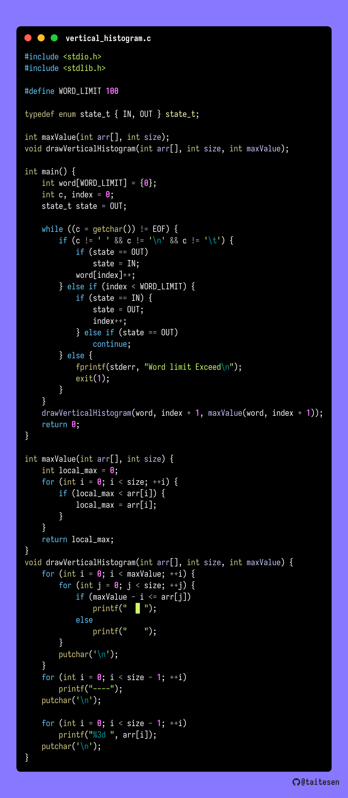
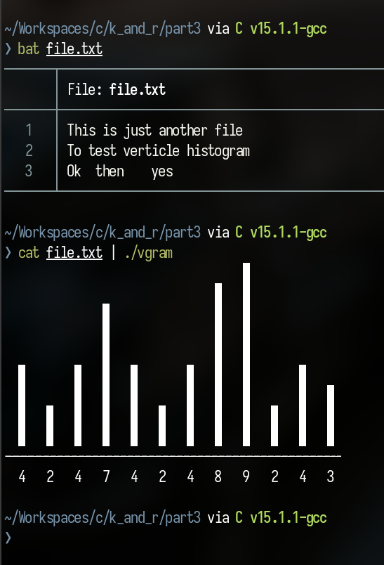
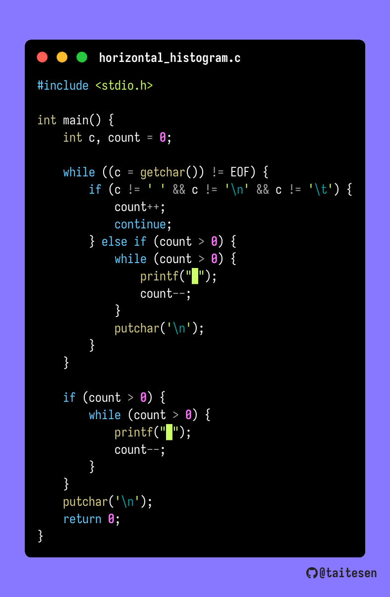
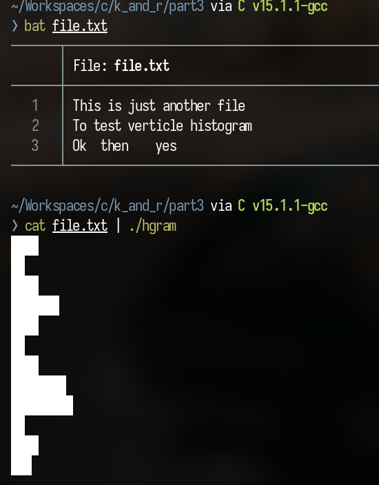

## TO COMPILE AND RUN HORIZONTAL HISTOGRAM
```bash
gcc horizontal_histogram.c -o hgram && cat file.txt | ./hgram
```

## TO COMPILE AND RUN VERTICAL HISTOGRAM
```bash
gcc vertical_histogram.c -o vgram && cat file.txt | ./vgram
```

## VERTICAL HISTOGRAM

### OUTPUT


## HORIZONTAL HISTOGRAM

### OUTPUT



